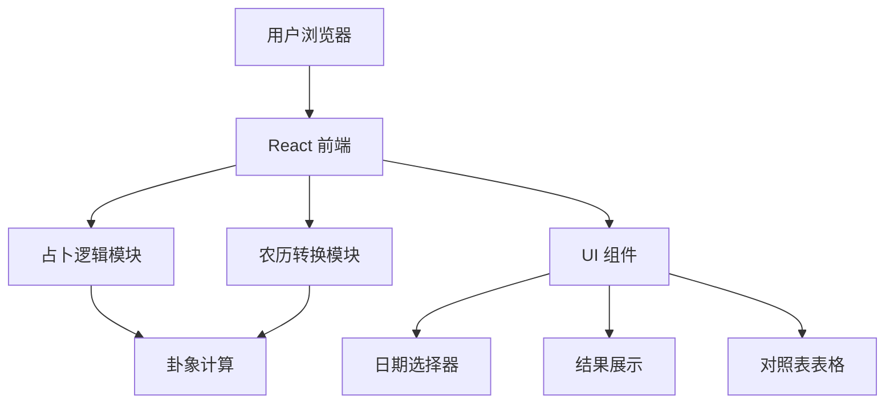

# 六壬占卜 Web 应用技术架构文档

## 1. Architecture Design


## 2. Technology Description
- 前端：React@18 + TypeScript + Tailwind CSS@3 + Vite
- 初始化工具：vite-init
- 后端：无（纯前端应用）
- 数据库：无
- 部署平台：Vercel

## 3. Route Definitions
| Route | Purpose |
|-------|---------|
| / | 占卜主页 |

## 4. API Definitions
无后端 API，所有逻辑在前端实现。

## 5. Server Architecture Diagram
不适用，无后端服务。

## 6. Data Model
不适用，无数据库。

## 7. Core Logic Implementation

### 7.1 卦象数据结构
```typescript
interface Gua {
  result: string;
  desc: string;
  gua: string;
  element: string;
}

const guaList: Gua[] = [
  { result: "大安", desc: "大吉，诸事顺利", gua: "震", element: "木" },
  { result: "留连", desc: "小凶，事情拖延", gua: "巽", element: "木" },
  { result: "速喜", desc: "中吉，快速成功", gua: "离", element: "火" },
  { result: "赤口", desc: "大凶，口舌是非", gua: "兑", element: "金" },
  { result: "小吉", desc: "小吉，平稳顺利", gua: "坎", element: "水" },
  { result: "空亡", desc: "大凶，诸事不顺", gua: "中", element: "土" },
  { result: "病符", desc: "小凶，健康不佳", gua: "坤", element: "土" },
  { result: "桃花", desc: "中吉，感情运势", gua: "艮", element: "土" },
  { result: "天德", desc: "大吉，贵人相助", gua: "乾", element: "金" }
];
```

### 7.2 时辰映射
```typescript
const shichenMap: Record<string, number> = {
  "子": 1, "丑": 2, "寅": 3, "卯": 4,
  "辰": 5, "巳": 6, "午": 7, "未": 8,
  "申": 9, "酉": 10, "戌": 11, "亥": 12
};

const shichenNames = ["子", "丑", "寅", "卯", "辰", "巳", "午", "未", "申", "酉", "戌", "亥"];
```

### 7.3 农历转换
使用 `lunar-javascript` 库进行公历与农历的转换。

## 8. Project Structure
```
/workspace/
├── public/
│   └── favicon.ico
├── src/
│   ├── components/
│   │   ├── DatePicker.tsx
│   │   ├── GuaResult.tsx
│   │   ├── GuaTable.tsx
│   │   ├── ShichenTable.tsx
│   │   └── FutureGuaTable.tsx
│   ├── utils/
│   │   ├── divination.ts
│   │   └── lunar.ts
│   ├── App.tsx
│   ├── main.tsx
│   └── index.css
├── package.json
├── tsconfig.json
├── vite.config.ts
├── tailwind.config.js
├── postcss.config.js
└── vercel.json
```

## 9. Deployment Configuration
使用 Vercel 部署，配置文件 `vercel.json` 如下：
```json
{
  "buildCommand": "npm run build",
  "outputDirectory": "dist",
  "framework": "vite"
}
```
