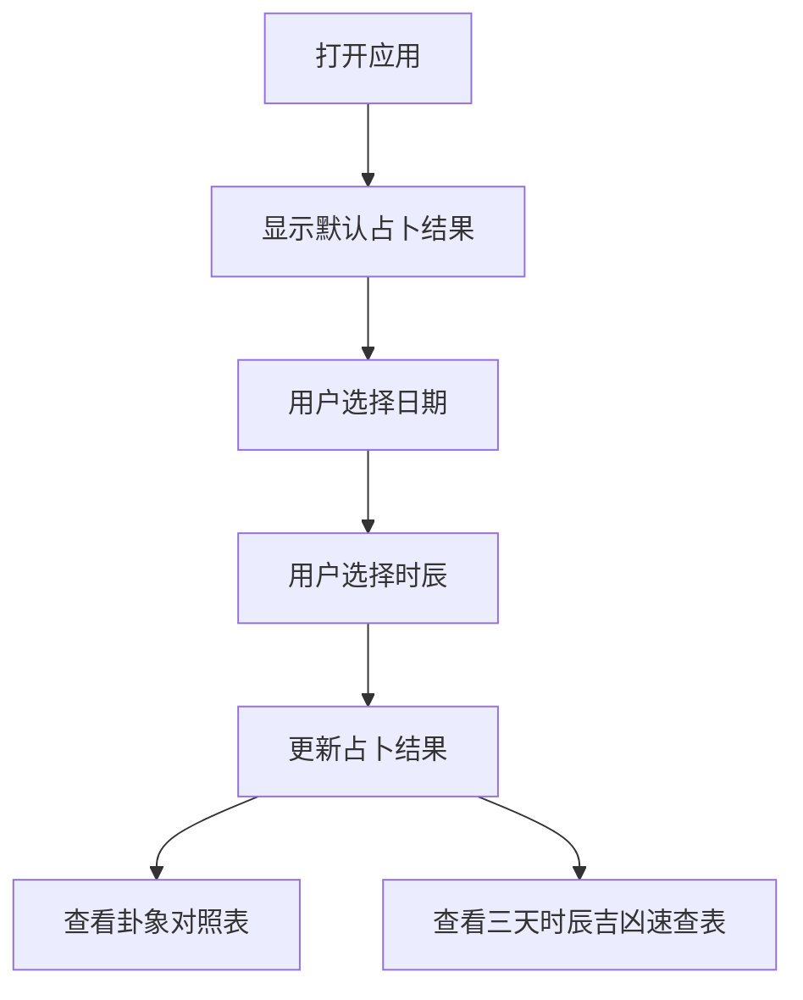

# 六壬占卜 Web 应用产品需求文档

## 1. Product Overview
六壬占卜是一个基于传统中国占卜术的Web应用，为用户提供在线占卜服务，帮助用户了解每日时辰吉凶和卦象预测。
- 主要目的：将原有的桌面应用转化为Web版本，提供更便捷的访问方式
- 目标用户：对传统占卜文化感兴趣的用户群体

## 2. Core Features

### 2.1 User Roles
无需用户角色区分，所有用户均可使用所有功能。

### 2.2 Feature Module
1. **占卜主页**：日期选择、时辰选择、占卜结果展示
2. **卦象对照表**：展示所有卦象的详细信息
3. **三天时辰吉凶速查表**：展示未来三天的时辰吉凶

### 2.3 Page Details
| Page Name | Module Name | Feature description |
|-----------|-------------|---------------------|
| 占卜主页 | 日期选择 | 使用日历组件选择占卜日期，默认当天 |
| 占卜主页 | 时辰选择 | 下拉菜单选择时辰，支持12个传统时辰，默认当前时辰 |
| 占卜主页 | 占卜结果展示 | 显示公历日期、农历日期、时辰、卦象结果、描述、五行属性及完整推算过程 |
| 占卜主页 | 卦象对照表 | 展示9个卦象的结果、描述、卦象、五行信息 |
| 占卜主页 | 时辰对照表 | 展示12个时辰对应的时间范围 |
| 占卜主页 | 三天时辰吉凶速查表 | 展示未来三天各时辰的吉凶预测，吉时高亮显示 |

## 3. Core Process
用户打开应用，默认显示当天当前时辰的占卜结果。用户可以选择不同的日期和时辰，系统实时更新占卜结果。用户也可以查看卦象对照表和未来三天的时辰吉凶速查表。

## 4. User Interface Design

### 4.1 Design Style
- **主色调**：深红色（#8B0000）搭配金色（#D4AF37），体现传统中国文化的尊贵感
- **辅助色**：米白色（#F5F5DC）作为背景，深灰色（#333333）作为文字
- **按钮风格**：圆角矩形，带有轻微阴影，悬停时有放大效果
- **字体**：使用 Noto Serif SC（中文宋体风格）和 Noto Sans SC（中文无衬线）组合
- **布局风格**：卡片式布局，左右分栏，左侧为占卜结果，右侧为对照表
- **图标**：使用传统中国风格的图标和装饰元素

### 4.2 Page Design Overview
| Page Name | Module Name | UI Elements |
|-----------|-------------|-------------|
| 占卜主页 | 标题区域 | 大标题"六壬占卜"，使用金色渐变文字，居中显示 |
| 占卜主页 | 输入区域 | 日期选择器和时辰选择器并排显示，使用卡片样式 |
| 占卜主页 | 占卜结果区域 | 大卡片展示，卦象结果用大号字体突出显示，吉时用红色标注 |
| 占卜主页 | 卦象对照表 | 表格形式，交替行背景色，表头固定 |
| 占卜主页 | 时辰对照表 | 简洁的文本展示，使用网格布局 |
| 占卜主页 | 三天时辰吉凶速查表 | 可滚动表格，吉时用红色高亮显示 |

### 4.3 Responsiveness
- 桌面端优先设计，采用左右分栏布局
- 平板端适配为上下布局
- 移动端单列布局，所有模块垂直排列
- 触摸交互优化，按钮和选择器尺寸适合触摸操作

### 4.4 3D Scene Guidance
不适用3D场景。
